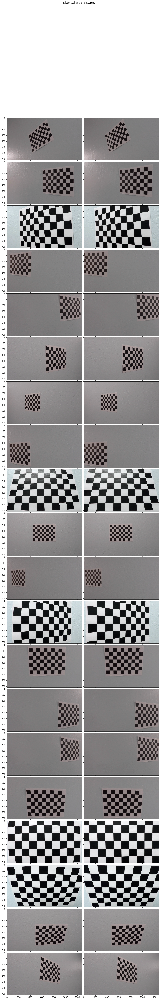
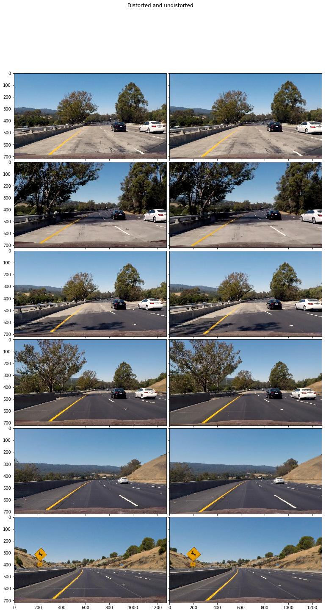
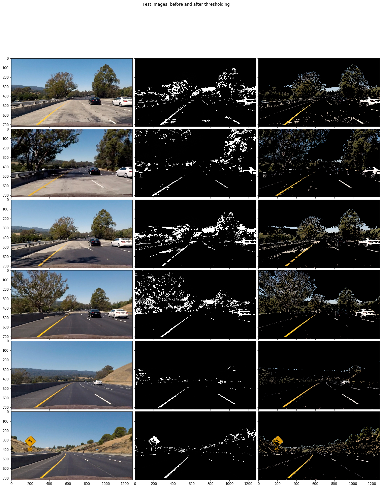
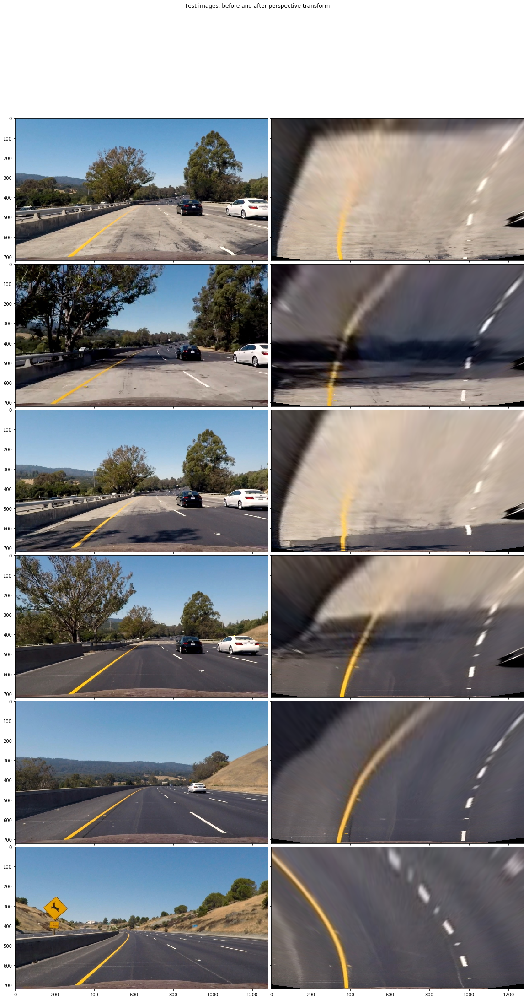
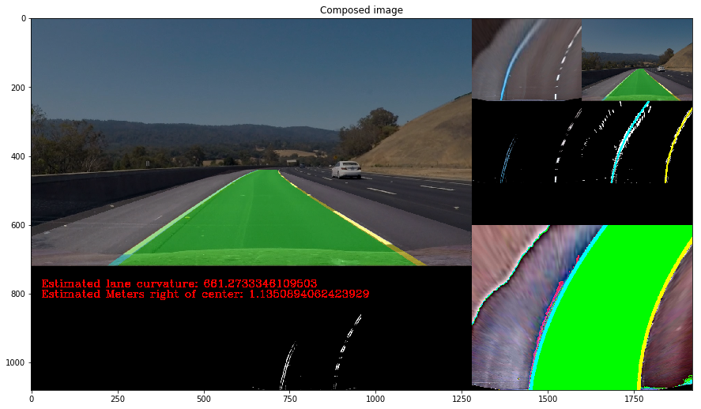

## Advanced Lane Finding Project

The goals / steps of this project are the following:

* Compute the camera calibration matrix and distortion coefficients given a set of chessboard images.
* Apply a distortion correction to raw images.
* Use color transforms, gradients, etc., to create a thresholded binary image.
* Apply a perspective transform to rectify binary image ("birds-eye view").
* Detect lane pixels and fit to find the lane boundary.
* Determine the curvature of the lane and vehicle position with respect to center.
* Warp the detected lane boundaries back onto the original image.
* Output visual display of the lane boundaries and numerical estimation of lane curvature and vehicle position.

---
## Camera Calibration


```python
import matplotlib.pyplot as plt
%matplotlib inline

from IPython.display import display as display
from IPython.core.pylabtools import figsize, getfigs
import math
import matplotlib.image as mpimg
import matplotlib.transforms as mtransforms
import numpy as np
import cv2
from tqdm import tqdm
   
def draw_image(img, title):
    """ Draw a single image with a title """
    f = plt.figure(figsize=(15, 15))
    plt.title(title)
    plt.imshow(img, cmap='gray')
    display(f)
    plt.close(f)
    
import matplotlib.pyplot as plt
from mpl_toolkits.axes_grid1 import ImageGrid
import numpy as np

def draw_grid(imgs, title='', img_shape = [100, 100], cols = 2, width = 5):
    rows = math.ceil(len(imgs)/cols)
    fig = plt.figure(figsize=(width, int(0.7*(img_shape[0]*rows)*width/(cols*img_shape[1]))))

    grid = ImageGrid(fig, 111,  # similar to subplot(111)
                     nrows_ncols=(rows, cols),
                     axes_pad=0.1,  # pad between axes in inch.
                     )
    for i in range(len(imgs)):
        grid[i].imshow(imgs[i], cmap='gray')
    fig.subplots_adjust(hspace=0)    
    plt.suptitle(title)    
    plt.show()
    
def toRGB(img):
    return cv2.cvtColor(img.astype(np.uint8), cv2.COLOR_BGR2RGB)
```


```python
import numpy as np
import cv2
import glob
import matplotlib.pyplot as plt
from tqdm import tqdm

# prepare object points, like (0,0,0), (1,0,0), (2,0,0) ....,(6,5,0)
objp = np.zeros((6*9,3), np.float32)
objp[:,:2] = np.mgrid[0:9,0:6].T.reshape(-1,2)

# Make a list of calibration images
images = glob.glob('./camera_cal/calibration*.jpg')

def read_images(images):
    out_images = []
    for fname in images:
        img = cv2.imread(fname)
        out_images.append(img)
    return out_images

imgs = read_images(images)
clahe = cv2.createCLAHE(clipLimit=2.0, tileGridSize=(8,8))

class Camera:
    def __init__(self):
        self.cameraMatrix = None
        self.distCoeffs = None
        self.rvecs = None
        self.tvecs = None
        self.objpoints = []
        self.imgpoints = []
        
    def calibrate(self, imgs, draw = True):
        for img in tqdm(imgs):
            gray = cv2.cvtColor(img,cv2.COLOR_BGR2GRAY)

            # Find the chessboard corners
            ret, corners = cv2.findChessboardCorners(gray, (9,6), None)

            # If found, add object points, image points
            if ret == True:
                self.objpoints.append(objp)
                self.imgpoints.append(corners)

                if draw == True:
                    # Draw and display the corners
                    outimg = cv2.drawChessboardCorners(img, (9,6), corners, ret)
                    draw_image(outimg, "Chessboard Corners")
                   
        retval, self.cameraMatrix, self.distCoeffs, self.rvecs, self.tvecs = cv2.calibrateCamera(self.objpoints, self.imgpoints, gray.shape, None, None)
   
    def undistort(self, img, draw = False):
        out_img = cv2.undistort(img, self.cameraMatrix, self.distCoeffs, None, self.cameraMatrix)
        if draw == True:
            draw_image(out_img, "Undistorted")
        return out_img
    
    def birdseye_transform(self, img):
        return cv2.warpPerspective(img, M, img.shape[:2][::-1], flags=cv2.INTER_CUBIC)
    
    def birdseye_inverse(self, img):
        return cv2.warpPerspective(img, Minv, img.shape[:2][::-1], flags=cv2.INTER_CUBIC)
    
    def clahe_l(self, img):
        lab = cv2.cvtColor(img, cv2.COLOR_BGR2LAB)
        l, a, b = cv2.split(lab)
        cl = clahe.apply(l)
        limg = cv2.merge((cl, a, b))
        final = cv2.cvtColor(limg, cv2.COLOR_LAB2BGR)
        return final 
    
    def threshold(self, img, s_thresh=(170, 255), sx_thresh=(20, 100)):
        img = np.copy(img)
        # Convert to HSV color space and separate the V channel
        hsv = cv2.cvtColor(img, cv2.COLOR_RGB2HLS).astype(np.float)
        l_channel = hsv[:,:,1]
        s_channel = hsv[:,:,2]
        # Sobel x
        sobelx = cv2.Sobel(l_channel, cv2.CV_64F, 1, 0) # Take the derivative in x
        abs_sobelx = np.absolute(sobelx) # Absolute x derivative to accentuate lines away from horizontal
        scaled_sobel = np.uint8(255*abs_sobelx/np.max(abs_sobelx))
        
        # Threshold x gradient
        sxbinary = np.zeros_like(scaled_sobel)
        sxbinary[(scaled_sobel >= sx_thresh[0]) & (scaled_sobel <= sx_thresh[1])] = 1
        
        # Threshold color channel
        s_binary = np.zeros_like(s_channel)
        s_binary[(s_channel >= s_thresh[0]) & (s_channel <= s_thresh[1])] = 1
        # Stack each channel
        # Note color_binary[:, :, 0] is all 0s, effectively an all black image. It might
        # be beneficial to replace this channel with something else.
        #color_binary = np.dstack(( np.zeros_like(sxbinary), sxbinary, s_binary))
        color_binary = sxbinary
        return color_binary
     
    
    def color_crop_img(self, img, applyMask=False):
        """Threshold the image in HSV color space to get yellow lines and
        HLS color space to get white and yellow lines, and return a mask
        of the regions containing those thresholded parts of the image."""
        hsv_image = cv2.cvtColor(self.clahe_l(img), cv2.COLOR_BGR2HSV)
        yellow_mask = cv2.inRange(hsv_image, np.array([90,30,100]), np.array([100, 255, 255]))
        hls_img = cv2.cvtColor(img, cv2.COLOR_BGR2HLS)
        l = clahe.apply(hls_img[:,:,1])
        l_mask = cv2.threshold(l, 225, 256, cv2.THRESH_BINARY)[1]
        both_mask = yellow_mask | l_mask
        
        threshold = self.threshold(img)
        all_mask = both_mask | threshold
        if applyMask == True:
            return self.mask_image(img, all_mask), yellow_mask, l_mask, threshold
        else:
            return all_mask, yellow_mask, l_mask, threshold
    
    def mask_image(self, img, mask):
        """Apply a mask to an image"""
        return cv2.bitwise_and(img, img, mask=mask)
    
    def process(self, img):
        img = toRGB(img)
        return self.birdseye_transform(self.color_crop_img(self.undistort(img))[0])
 

source_points = [(610, 440), (204, 720), (1128,720), (678,440)]
warped_points = [(320, 0), (320, 720), (960,720), (960,0)]

source_points = np.float32(source_points)
warped_points = np.float32(warped_points)
M = cv2.getPerspectiveTransform(source_points, warped_points)
Minv = cv2.getPerspectiveTransform(warped_points, source_points)

camera = Camera()
camera.calibrate(imgs, False)

checkerboard_display_imgs = []
for img in tqdm(imgs):
    checkerboard_display_imgs.append(img)
    undistorted = camera.undistort(img, False)
    checkerboard_display_imgs.append(undistorted)

```

    100%|██████████| 20/20 [00:05<00:00,  4.44it/s]
    100%|██████████| 20/20 [00:00<00:00, 38.43it/s]


**Briefly state how you computed the camera matrix and distortion coefficients. Provide an example of a distortion corrected calibration image.**

The camera matrix and distortion coefficients are handled by the Camera class in the above code cell. The `camera.calibrate` function takes a list of chessboard images. For each image, the `objpoints` and `imgpoints` and calculated using `cv2.findChessboardCorners`. `cv2.calibrateCamera` is then used to take the object and image points and return the camera matrix and distortion coefficients.

Once calibrated, the `Camera` class can be used to undistort images by passing them to the `camera.undistort` function.

The distorted and undistorted chessboard images are displayed in the following code cell.


```python
draw_grid(checkerboard_display_imgs, "Distorted and undistorted", img.shape[:2], 2, 20)
```





## Pipeline (single images)

**Provide an example of a distortion-corrected image.**

The next code cell draws the distorted and undistorted test images using the camera matrix and distance coefficients calibrated using the chessboard images.


```python
test_images = glob.glob('./test_images/test*.jpg')

test_images_display = []
for img in read_images(test_images):
    test_images_display.append(toRGB(img))
    undistorted = camera.undistort(img, False)
    test_images_display.append(toRGB(undistorted))
    
draw_grid(test_images_display, "Distorted and undistorted", test_images_display[0].shape[:2], 2, 20)
```





**Describe how (and identify where in your code) you used color transforms, gradients or other methods to create a thresholded binary image. Provide an example of a binary image result.**

The `camera.color_crop_img` function in the `Camera` class (above) takes a color image and returns either a binary mask if `applyMask` is `False`, or the mask applied to the input image if `applyMask` is `True`.

The function does three types of thresholding:
* Convert the image to HSV color space and get pixels where 90 <= H <= 100 and 30 <= S <= 255 and 100 <= V <= 255. This effectively returns the yellow pixels of the image.
* Convert the image to HLS color space and get pixels where 225 <= L <= 255. This effectively gets the white pixels of the image.
* Use Sobel edge detection in the x direction on the L channel of the image in HLS space, as described in the course notes. This gets the gradients in the image, which is useful for parts of the lane lines that aren't white or yellow but still stand out from the surrounding road.

The exact values used in the thresholding were tuned on a color wheel image.

The following code cell displays the color wheel, before and after thresholding, and each of the test images, with the original image, the thresholding mask, and the image with the mask applied.


```python
color_wheel = read_images(glob.glob('./examples/color-wheel.png'))
draw_grid([toRGB(color_wheel[0]), camera.color_crop_img(toRGB(color_wheel[0]), True)[0]],
         "Color wheel, before and after color thresholding", color_wheel[0].shape[:2], 2, 20)

sample_images = []

for img in tqdm(read_images(test_images)):
    img_undistorted = camera.undistort(toRGB(img), False)
    sample_images.append(img_undistorted)
    sample_images.append(camera.color_crop_img(img_undistorted, False)[0])
    sample_images.append(camera.color_crop_img(img_undistorted, True)[0])
draw_grid(sample_images, "Test images, before and after thresholding", sample_images[0].shape[:2], 3, 30)

```


    100%|██████████| 6/6 [00:00<00:00,  7.78it/s]





**Describe how (and identify where in your code) you performed a perspective transform and provide an example of a transformed image.**

The perspective transform is handled by the `camera.birdseye_transform` function in the `Camera` class (above).

The following code cell displays the perspective transform applied to each of the test images.


```python
birdseye_images = []

for img in tqdm(read_images(test_images)):
    img_undistorted = camera.undistort(toRGB(img), False)
    birdseye_images.append(img_undistorted)
    birdseye_images.append(camera.birdseye_transform(img_undistorted))
draw_grid(birdseye_images, "Test images, before and after perspective transform", birdseye_images[0].shape[:2], 2, 30)


```

    100%|██████████| 6/6 [00:00<00:00, 18.88it/s]





```python
# From https://carnd-forums.udacity.com/questions/32706990/want-to-create-a-diagnostic-view-into-your-lane-finding-pipeline
def normalized(img):
    return np.uint8(255*img/np.max(np.absolute(img)))

def to_RGB(img):
   if img.ndim == 2:
       img_normalized = normalized(img)
       return np.dstack((img_normalized, img_normalized, img_normalized))
   elif img.ndim == 3:
       return img
   else:
       return None

def compose_diagScreen(curverad=0, offset=0, mainDiagScreen=None,
                     diag1=None, diag2=None, diag3=None, diag4=None, diag5=None, diag6=None, diag7=None, diag8=None, diag9=None):
      # middle panel text example
      # using cv2 for drawing text in diagnostic pipeline.
      font = cv2.FONT_HERSHEY_COMPLEX
      middlepanel = np.zeros((120, 1280, 3), dtype=np.uint8)
      cv2.putText(middlepanel, 'Estimated lane curvature: {}'.format(curverad), (30, 60), font, 1, (255,0,0), 2)
      cv2.putText(middlepanel, 'Estimated Meters right of center: {}'.format(offset), (30, 90), font, 1, (255,0,0), 2)

      # assemble the screen example
      diagScreen = np.zeros((1080, 1920, 3), dtype=np.uint8)
      if mainDiagScreen is not None:
            diagScreen[0:720, 0:1280] = mainDiagScreen
      if diag1 is not None:
            diagScreen[0:240, 1280:1600] = cv2.resize(to_RGB(diag1), (320,240), interpolation=cv2.INTER_AREA) 
      if diag2 is not None:
            diagScreen[0:240, 1600:1920] = cv2.resize(to_RGB(diag2), (320,240), interpolation=cv2.INTER_AREA)
      if diag3 is not None:
            diagScreen[240:480, 1280:1600] = cv2.resize(to_RGB(diag3), (320,240), interpolation=cv2.INTER_AREA)
      if diag4 is not None:
            diagScreen[240:480, 1600:1920] = cv2.resize(to_RGB(diag4), (320,240), interpolation=cv2.INTER_AREA)*4
      if diag5 is not None:
            diagScreen[600:1080, 1280:1920] = cv2.resize(to_RGB(diag5), (640,480), interpolation=cv2.INTER_AREA)*4
      diagScreen[720:840, 0:1280] = middlepanel
      if diag6 is not None:
            diagScreen[840:1080, 0:320] = cv2.resize(to_RGB(diag6), (320,240), interpolation=cv2.INTER_AREA)
      if diag7 is not None:
            diagScreen[840:1080, 320:640] = cv2.resize(to_RGB(diag7), (320,240), interpolation=cv2.INTER_AREA)
      if diag8 is not None:
            diagScreen[840:1080, 640:960] = cv2.resize(to_RGB(diag8), (320,240), interpolation=cv2.INTER_AREA)
      if diag9 is not None:
            diagScreen[840:1080, 960:1280] = cv2.resize(to_RGB(diag9), (320,240), interpolation=cv2.INTER_AREA)

      return diagScreen
```

**Describe how (and identify where in your code) you identified lane-line pixels and fit their positions with a polynomial.**

The `fit_lanes` method in the `Lane` class (below) takes in an image that has been tranformed using the perspective transform and thresholded as described above. It uses the sliding windows method, as described in the course notes, to identify the pixels of the left and right lane lines. It then calls the `update` method of the `Lane` object's internal left and right `Line` objects to update their coefficients.

The `update` method in the `Line` class (in the below code cell) fits lines to a 2nd order polynomial using the passed in x and y coordinates. It validates that the curvature and number of points are reasonable, and if so, adds the coefficients to a circular buffer with a maximum length of 5. The final coefficients for each lane are the mean of the coefficients in the circular buffer.

**Describe how (and identify where in your code) you calculated the radius of curvature of the lane and the position of the vehicle with respect to center.**

The radius of curvature is calculated in the `line.rad` function of the `Line` class in the following code cell.

As described in the course notes, it is calculated using the coefficients and the equation described in the course notes, and evaluated using the y coordinate at the bottom of the image.

For the lane, the curvature is the average of the curvature of the left and right lane lines. This is calculated in the `lane.detect` method of the `Lane` class in the following code cell.


```python
import collections
class Lane():
    def __init__(self):
        self.left = Line()
        self.right = Line()
        self.radius = None
        self.offset = None
        
    def detect(self, img, draw=False):
        birdseye_img = camera.birdseye_transform(camera.undistort(img))
        processed_img = camera.process(img)
        overlay = birdseye_img.copy()
        final_img, left_fitx, right_fitx = self.fit_lanes(processed_img.copy())
        
        ploty = np.linspace(0, img.shape[0]-1, img.shape[0] )
        
        pts_left = np.array([np.transpose(np.vstack([left_fitx, ploty]))])
        pts_right = np.array([np.flipud(np.transpose(np.vstack([right_fitx, ploty])))])
        pts = np.hstack((pts_left, pts_right))
        
        # Draw the lane onto the warped blank image
        cv2.fillPoly(overlay, np.int_([pts]), (0,255, 0))
        self.left.draw(overlay, (0, 255, 255))
        self.right.draw(overlay, (255, 255, 0))
        
        l_rad, l_offset = self.left.get_rad_offset()
        r_rad, r_offset = self.right.get_rad_offset()
        
        self.radius = (l_rad + r_rad)/2
        
        xm_per_pix = 3.7/640 # meters per pixel in x dimension
        self.offset = (img.shape[0]/2 -(l_offset + r_offset)/2)*xm_per_pix
        
        cv2.addWeighted(camera.birdseye_inverse(overlay), 0.4, toRGB(img), 0.6, 0, img)
        
        thresh, mask1, mask2, mask3 = camera.color_crop_img(birdseye_img, True)
        composed_img = compose_diagScreen(self.radius, self.offset, img, birdseye_img, img, 
                                         thresh, final_img, overlay, 
                                         mask1, mask2, mask3)
            
        if draw == True:
            draw_image(composed_img, "Composed image")
        
        return composed_img

    def fit_lanes(self, binary_warped):
        # Take a histogram of the bottom half of the image
        histogram = np.sum(binary_warped[int(binary_warped.shape[0]/2):,:], axis=0)
        
        # Create an output image to draw on and  visualize the result
        out_img = np.dstack((binary_warped, binary_warped, binary_warped))*255
        
        # Find the peak of the left and right halves of the histogram
        # These will be the starting point for the left and right lines
        midpoint = np.int(histogram.shape[0]/2)
        leftx_base = np.argmax(histogram[:midpoint])
        rightx_base = np.argmax(histogram[midpoint:]) + midpoint
        
        # Choose the number of sliding windows
        nwindows = 9
        # Set height of windows
        window_height = np.int(binary_warped.shape[0]/nwindows)
        # Identify the x and y positions of all nonzero pixels in the image
        nonzero = binary_warped.nonzero()
        nonzeroy = np.array(nonzero[0])
        nonzerox = np.array(nonzero[1])
        # Current positions to be updated for each window
        leftx_current = leftx_base
        rightx_current = rightx_base
        # Set the width of the windows +/- margin
        margin = 100
        # Set minimum number of pixels found to recenter window
        minpix = 50
        # Create empty lists to receive left and right lane pixel indices
        left_lane_inds = []
        right_lane_inds = []
        
        # Step through the windows one by one
        for window in range(nwindows):
            # Identify window boundaries in x and y (and right and left)
            win_y_low = binary_warped.shape[0] - (window+1)*window_height
            win_y_high = binary_warped.shape[0] - window*window_height
            win_xleft_low = leftx_current - margin
            win_xleft_high = leftx_current + margin
            win_xright_low = rightx_current - margin
            win_xright_high = rightx_current + margin
            # Draw the windows on the visualization image
            #cv2.rectangle(out_img,(win_xleft_low,win_y_low),(win_xleft_high,win_y_high),(0,255,0), 2) 
            #cv2.rectangle(out_img,(win_xright_low,win_y_low),(win_xright_high,win_y_high),(0,255,0), 2) 
            # Identify the nonzero pixels in x and y within the window
            good_left_inds = ((nonzeroy >= win_y_low) & (nonzeroy < win_y_high) & (nonzerox >= win_xleft_low) & (nonzerox < win_xleft_high)).nonzero()[0]
            good_right_inds = ((nonzeroy >= win_y_low) & (nonzeroy < win_y_high) & (nonzerox >= win_xright_low) & (nonzerox < win_xright_high)).nonzero()[0]
            # Append these indices to the lists
            left_lane_inds.append(good_left_inds)
            right_lane_inds.append(good_right_inds)
            # If you found > minpix pixels, recenter next window on their mean position
            if len(good_left_inds) > minpix:
                leftx_current = np.int(np.mean(nonzerox[good_left_inds]))
            if len(good_right_inds) > minpix:        
                rightx_current = np.int(np.mean(nonzerox[good_right_inds]))
        
        # Concatenate the arrays of indices
        left_lane_inds = np.concatenate(left_lane_inds)
        right_lane_inds = np.concatenate(right_lane_inds)
        
        # Extract left and right line pixel positions
        leftx = nonzerox[left_lane_inds]
        lefty = nonzeroy[left_lane_inds] 
        rightx = nonzerox[right_lane_inds]
        righty = nonzeroy[right_lane_inds] 
        
        if self.validate(leftx, lefty, rightx, righty):
            self.left.update(leftx, lefty)
            self.right.update(rightx, righty)
        
        l_img, l_fitx = self.left.draw(out_img, (0, 255, 255))
        r_img, r_fitx = self.right.draw(out_img, (255, 255, 0))
       
        return out_img, l_fitx, r_fitx
    
    def validate(self, leftx, lefty, rightx, righty):
        left_fit = np.polyfit(lefty, leftx, 2)
        right_fit = np.polyfit(righty, rightx, 2)
        
        return True
        
# Define a class to receive the characteristics of each line detection
class Line():
    def __init__(self):
        # was the line detected in the last iteration?
        self.detected = False  
        # x values of the last n fits of the line
        self.recent_xfitted = collections.deque(maxlen=5)
        #average x values of the fitted line over the last n iterations
        self.bestx = None     
        #polynomial coefficients averaged over the last n iterations
        self.best_fit = None  
        #polynomial coefficients for the most recent fit
        self.current_fit = [np.array([False])]  
        #radius of curvature of the line in some units
        self.radius_of_curvature = None 
        #distance in meters of vehicle center from the line
        self.line_base_pos = None 
        #difference in fit coefficients between last and new fits
        self.diffs = np.array([0,0,0], dtype='float') 
        #x values for detected line pixels
        self.allx = None  
        #y values for detected line pixels
        self.ally = None
        
    def get_rad_offset(self):
        return self.radius_of_curvature, self.line_base_pos
    
    def validate(self, xs, fit_cr):
        if xs is None or len(xs) < 15:
            return False
        
        if abs(self.rad(fit_cr)) < 150:
            return False
        
        return True
    
    def rad(self, fit_cr = None):
        if fit_cr == None:
            fit_cr = self.current_fit
        y_eval = 719
        ym_per_pix = 51/720 # meters per pixel in y dimension
        
        curverad = ((1 + (2*fit_cr[0]*y_eval*ym_per_pix + fit_cr[1])**2)**1.5) / np.absolute(2*fit_cr[0])
        
        return curverad

    def get_avg_fit(self):
        return sum(self.recent_xfitted)/len(self.recent_xfitted)
        
    def update(self, xs, ys):
        if self.validate(xs, np.polyfit(ys, xs, 2)) == False:
            self.detected = False
        else:
            self.detected = True
            # Fit a second order polynomial to each
            self.allx = xs
            self.ally = ys
            fit = np.polyfit(ys, xs, 2)
            self.recent_xfitted.append(fit)
            self.current_fit = self.get_avg_fit()
            
            ym_per_pix = 50/720 # meters per pixel in y dimension
            xm_per_pix = 3.7/640 # meters per pixel in x dimension
            
            y_eval = 719
            fit_cr = np.polyfit(ys*ym_per_pix, xs*xm_per_pix, 2)
            self.radius_of_curvature = self.rad(fit_cr)
            
            self.line_base_pos = ((self.current_fit[0]*y_eval)**2 + self.current_fit[1]*y_eval + self.current_fit[2])/2
        
    def draw(self, img, color):
        ploty = np.linspace(0, img.shape[0]-1, img.shape[0] )
        fitx = self.current_fit[0]*ploty**2 + self.current_fit[1]*ploty + self.current_fit[2]
        
        cv2.polylines(img, [np.int_(list(zip(fitx, ploty)))], False, color, 20)
        return img, fitx
       


```

**Provide an example image of your result plotted back down onto the road such that the lane area is identified clearly.**

The `lane.detect` function draws the lane lines onto the image. The following cell displays an image with the lane lines drawn onto the original image.


```python
lane = Lane()
foo = lane.detect(cv2.imread(test_images[4]), True)
        
```

    /home/gkc/miniconda3/envs/carnd-term1/lib/python3.5/site-packages/ipykernel/__main__.py:164: FutureWarning: comparison to `None` will result in an elementwise object comparison in the future.
    /home/gkc/miniconda3/envs/carnd-term1/lib/python3.5/site-packages/ipykernel/__main__.py:3: RuntimeWarning: invalid value encountered in true_divide
      app.launch_new_instance()





## Pipeline (video)

**Provide a link to your final video output. Your pipeline should perform reasonably well on the entire project video (wobbly lines are ok but no catastrophic failures that would cause the car to drive off the road!).**

The following cells process and display the video. It can also be viewed by opening `project_video_out.mp4`.


```python
from moviepy.editor import VideoFileClip
from IPython.display import HTML

def process_video(input_path, output_path):
    lane = Lane()
    clip = VideoFileClip(input_path)
    output_clip = clip.fl_image(lambda x: lane.detect(toRGB(x), False))
    output_clip.write_videofile(output_path, audio=False)
    
process_video("project_video.mp4", "project_video_out.mp4")
```

    [MoviePy] >>>> Building video project_video_out.mp4
    [MoviePy] Writing video project_video_out.mp4


    100%|█████████▉| 1260/1261 [06:40<00:00,  3.30it/s]


    [MoviePy] Done.
    [MoviePy] >>>> Video ready: project_video_out.mp4 
    


```python
HTML("""
<video width="960" height="540" controls>
  <source src="{0}">
</video>
""".format("project_video_out.mp4"))
```


<video width="960" height="540" controls>
  <source src="project_video_out.mp4">
</video>


## Discussion

**Briefly discuss any problems / issues you faced in your implementation of this project. Where will your pipeline likely fail? What could you do to make it more robust?**

Sadly, as I have finite time to work on this project, I was not able to attempt the challenges. However, looking at the challenge videos, there are several cases that would be difficult to handle using my current approach. In particular:
* Winding roads that can not be easily described using a simple 2nd order polynomial. Perhaps a spline-based approach would be better able to handle these types of roads.
* Large differences in brightness or exposure in the image can cause other features to be mistaken for white lines.
* Color variations can confuse the Sobel edge detection, which would add a lot of noise to the thresholded image. Averaging over multiple frames helps here.
* The camera shaking as the car drives over uneven surfaces may eventually cause the line to shift outside of the margin boundaries for adjusting subsequent frames of the image if the road surface is uneven enough, in which case the lines would have to be re-detected from scratch.
* Other vehicles or objects can occlude the lane lines, which may confuse the lane line detection. Averaging over multiple frames and tracking detected vehicles could be used to limit the effects from this.

As I mentioned in project 1, robustness of lane detection is limited by any assumptions that are baked into the code. For example:
* It is not safe to assume that the camera will be oriented correctly in the center of the car and angled with the horizon roughly in the center of the frame. A more robust solution would likely use features of the image to calibrate the camera at regular intervals (for example, attempting to detect the horizon based on large contrast differences in the top and bottom of the image, or attempting to detect the hood of the car by finding parts of the image that do not move between frames). Using this information, it would be possible to compute a perspective transform to "correct" any differences in the orientation of the camera prior to processing the frames.
* It isn't safe to assume that lane markers will always be yellow or white. According to Wikipedia, in the UK red road markers are used to indicate the hard shoulder of highways, orange markers can indicate the edge of the median strip, and green markers can apparently indicate "slip roads at grade-separated junctions and also road-side lay-bys" (whatever that means). In many regions, red or yellow markings along a curb indicate whether parking is restricted.
* Although it is probably safe to assume that lane markings will generally be one of the highest contrast features on a road, all bets are off at night, or if it is snowing or raining.
